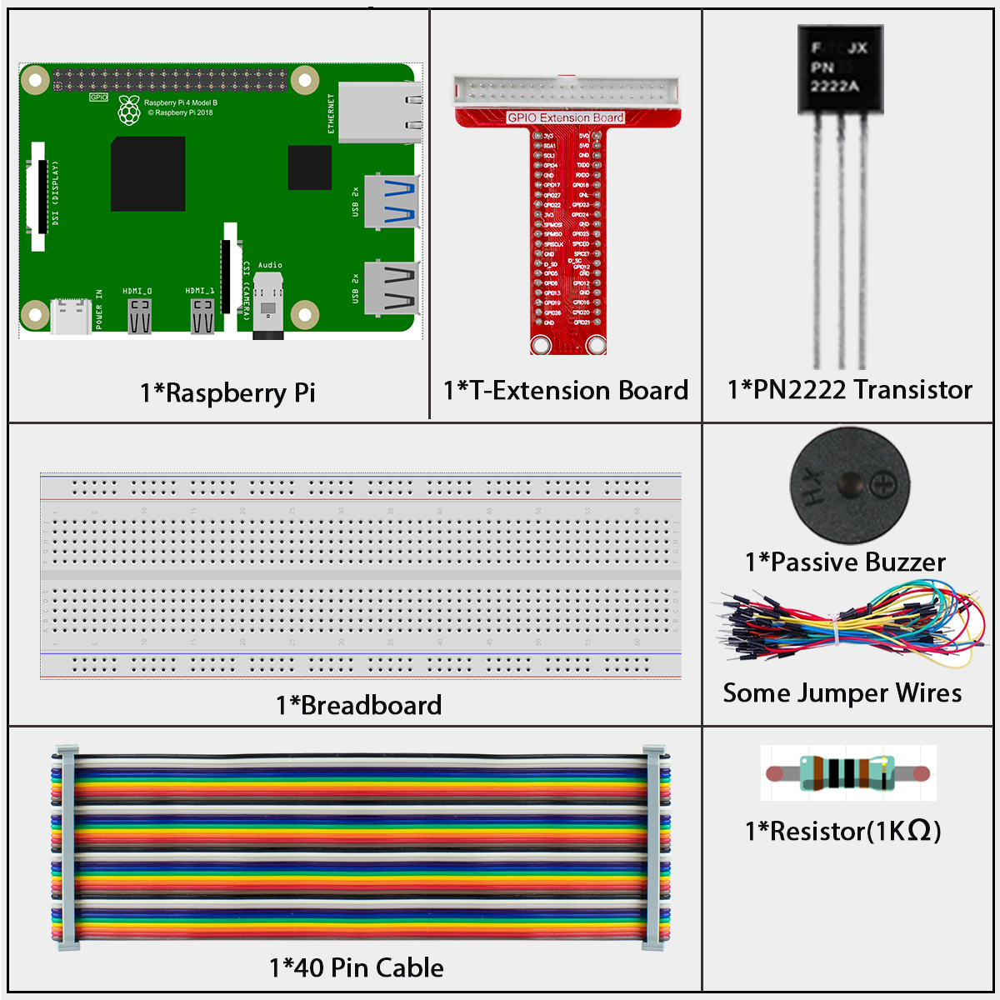

# 1.2.2 Passive Buzzer

## Introduction

In this lesson, we will learn how to make a passive buzzer play music.

## Components



In this experiment, a passive buzzer, a PNP transistor and a 1k resistor are used between the base of the transistor and GPIO to protect the transistor.

When GPIO17 is given different frequencies, the passive buzzer will emit different sounds; in this way, the buzzer plays music.


## connect


## Code

### For C Language User

Go to the code folder compile and run.

```sh
cd ~/Basic-Starter-Kit-for-Raspberry-Pi/c/1.2.2/
gcc 1.2.2_PassiveBuzzer.c -lwiringPi
sudo ./a.out
```

The code run, the buzzer plays a piece of music.

This is the complete code

```c
#include <wiringPi.h>
#include <softTone.h>
#include <stdio.h>

#define BuzPin    0

#define  CL1  131
#define  CL2  147
#define  CL3  165
#define  CL4  175
#define  CL5  196
#define  CL6  221
#define  CL7  248

#define  CM1  262
#define  CM2  294
#define  CM3  330
#define  CM4  350
#define  CM5  393
#define  CM6  441
#define  CM7  495

#define  CH1  525
#define  CH2  589
#define  CH3  661
#define  CH4  700
#define  CH5  786
#define  CH6  882
#define  CH7  990

int song_1[] = {CM3,CM5,CM6,CM3,CM2,CM3,CM5,CM6,CH1,CM6,CM5,CM1,CM3,CM2,
                CM2,CM3,CM5,CM2,CM3,CM3,CL6,CL6,CL6,CM1,CM2,CM3,CM2,CL7,
                CL6,CM1,CL5};

int beat_1[] = {1,1,3,1,1,3,1,1,1,1,1,1,1,1,3,1,1,3,1,1,1,1,1,1,1,2,1,1,
                1,1,1,1,1,1,3};


int song_2[] = {CM1,CM1,CM1,CL5,CM3,CM3,CM3,CM1,CM1,CM3,CM5,CM5,CM4,CM3,CM2,
                CM2,CM3,CM4,CM4,CM3,CM2,CM3,CM1,CM1,CM3,CM2,CL5,CL7,CM2,CM1
                };

int beat_2[] = {1,1,1,3,1,1,1,3,1,1,1,1,1,1,3,1,1,1,2,1,1,1,3,1,1,1,3,3,2,3};

int main(void)
{
    int i, j;
    if(wiringPiSetup() == -1){ //when initialize wiring failed,print message to screen
        printf("setup wiringPi failed !");
        return 1;
    }

    if(softToneCreate(BuzPin) == -1){
        printf("setup softTone failed !");
        return 1;
    }

    while(1){
        printf("music is being played...\n");
        delay(100);
        for(i=0;i<sizeof(song_1)/4;i++){
            softToneWrite(BuzPin, song_1[i]);
            delay(beat_1[i] * 500);
        }

        for(i=0;i<sizeof(song_2)/4;i++){
            softToneWrite(BuzPin, song_2[i]);
            delay(beat_2[i] * 500);
        }
    }

    return 0;
}
```

### For  Python  Language User

Go to the code folder and run.

```sh
cd ~/Basic-Starter-Kit-for-Raspberry-Pi/python
python 1.2.2_PassiveBuzzer.py
```

This is the complete code

```python
import RPi.GPIO as GPIO
import time

Buzzer = 11

CL = [0, 131, 147, 165, 175, 196, 211, 248]		# Frequency of Bass tone in C major

CM = [0, 262, 294, 330, 350, 393, 441, 495]		# Frequency of Midrange tone in C major

CH = [0, 525, 589, 661, 700, 786, 882, 990]		# Frequency of Treble tone in C major

song_1 = [	CM[3], CM[5], CM[6], CM[3], CM[2], CM[3], CM[5], CM[6], # Notes of song1
			CH[1], CM[6], CM[5], CM[1], CM[3], CM[2], CM[2], CM[3], 
			CM[5], CM[2], CM[3], CM[3], CL[6], CL[6], CL[6], CM[1],
			CM[2], CM[3], CM[2], CL[7], CL[6], CM[1], CL[5]	]

beat_1 = [	1, 1, 3, 1, 1, 3, 1, 1, 			# Beats of song 1, 1 means 1/8 beat
			1, 1, 1, 1, 1, 1, 3, 1, 
			1, 3, 1, 1, 1, 1, 1, 1, 
			1, 2, 1, 1, 1, 1, 1, 1, 
			1, 1, 3	]

song_2 = [	CM[1], CM[1], CM[1], CL[5], CM[3], CM[3], CM[3], CM[1], # Notes of song2
			CM[1], CM[3], CM[5], CM[5], CM[4], CM[3], CM[2], CM[2], 
			CM[3], CM[4], CM[4], CM[3], CM[2], CM[3], CM[1], CM[1], 
			CM[3], CM[2], CL[5], CL[7], CM[2], CM[1]	]

beat_2 = [	1, 1, 2, 2, 1, 1, 2, 2, 			# Beats of song 2, 1 means 1/8 beat
			1, 1, 2, 2, 1, 1, 3, 1, 
			1, 2, 2, 1, 1, 2, 2, 1, 
			1, 2, 2, 1, 1, 3 ]

def setup():

	GPIO.setmode(GPIO.BOARD)		# Numbers GPIOs by physical location
	GPIO.setup(Buzzer, GPIO.OUT)	# Set pins' mode is output
	global Buzz						# Assign a global variable to replace GPIO.PWM 
	Buzz = GPIO.PWM(Buzzer, 440)	# 440 is initial frequency.
	Buzz.start(50)					# Start Buzzer pin with 50% duty cycle

def loop():
	while True:
		print ('\n    Playing song 1...')
		for i in range(1, len(song_1)):		# Play song 1
			Buzz.ChangeFrequency(song_1[i])	# Change the frequency along the song note
			time.sleep(beat_1[i] * 0.5)		# delay a note for beat * 0.5s
		time.sleep(1)						# Wait a second for next song.

		print ('\n\n    Playing song 2...')
		for i in range(1, len(song_2)):     # Play song 1
			Buzz.ChangeFrequency(song_2[i]) # Change the frequency along the song note
			time.sleep(beat_2[i] * 0.5)     # delay a note for beat * 0.5s

def destory():
	Buzz.stop()                 # Stop the buzzer
	GPIO.output(Buzzer, 1)      # Set Buzzer pin to High
	GPIO.cleanup()				# Release resource

if __name__ == '__main__':		# Program start from here
	setup()
	try:
		loop()
	except KeyboardInterrupt:  	# When 'Ctrl+C' is pressed, the program destroy() will be executed.
		destory()
```

The code run, the buzzer plays a piece of music.

## Phenomenon


