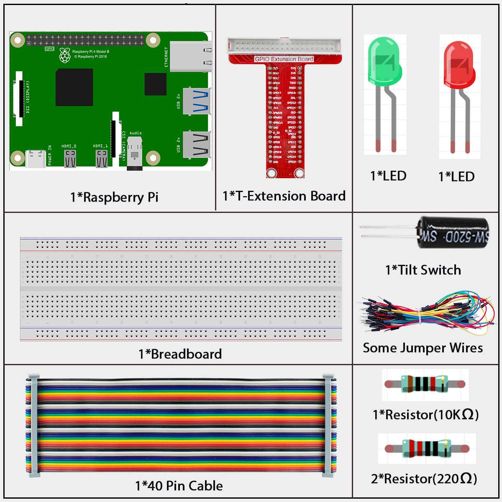
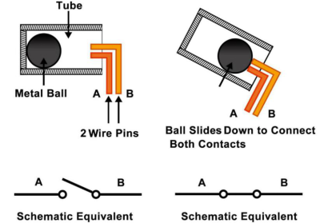
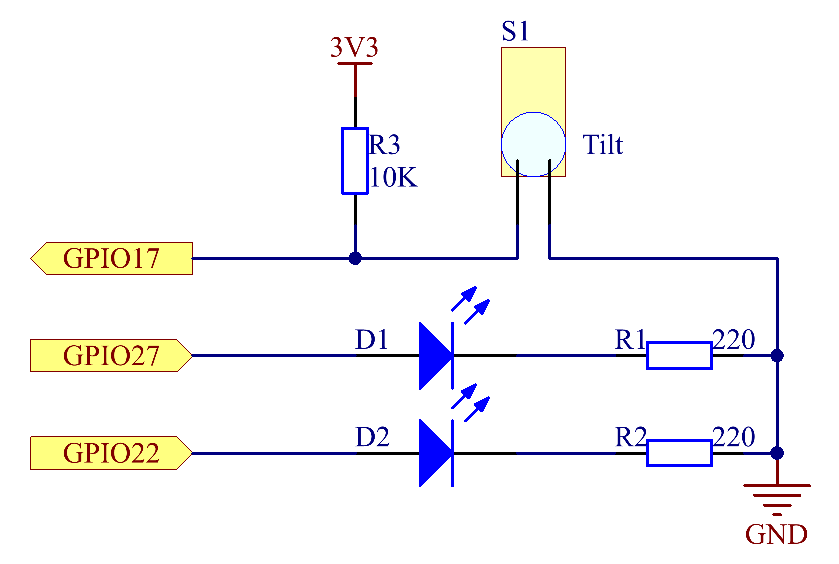

# 2.1.2 Tilt Switch

## Introduction

This is a ball tilt-switch with a metal ball inside. It is used to detect inclinations of a small angle.

## Components



**Tilt**

The principle is very simple. When the switch is tilted in a certain angle, the ball inside rolls down and touches the two contacts connected to the pins outside, thus triggering circuits. Otherwise the ball will stay away from the contacts, thus breaking the circuits.



## Connect




## Code

### For  C  Language User

Go to the code folder compile and run.

```sh
cd ~/Basic-Starter-Kit-for-Raspberry-Pi/c/2.1.2/
gcc 2.1.2_Tilt.c -lwiringPi
sudo ./a.out
```

Place the tilt horizontally, and the green LED will turns on. If you tilt it, "Tilt!" will be printed on the screen and the red LED will lights on. Place it horizontally again, and the green LED will turns on again.

This is the complete code

```c
#include <wiringPi.h>
#include <stdio.h>

#define TiltPin     0
#define Gpin        2
#define Rpin        3

void LED(char* color)
{
    pinMode(Gpin, OUTPUT);
    pinMode(Rpin, OUTPUT);
    if (color == "RED")
    {
        digitalWrite(Rpin, HIGH);
        digitalWrite(Gpin, LOW);
    }
    else if (color == "GREEN")
    {
        digitalWrite(Rpin, LOW);
        digitalWrite(Gpin, HIGH);
    }
    else
        printf("LED Error");
}

int main(void)
{
    if(wiringPiSetup() == -1){ //when initialize wiring failed,print message to screen
        printf("setup wiringPi failed !");
        return 1;
    }

    pinMode(TiltPin, INPUT);
    LED("GREEN");

    while(1){
        if(0 == digitalRead(TiltPin)){
            delay(10);
            if(0 == digitalRead(TiltPin)){
                LED("RED");
                printf("Tilt!\n");
                delay(100);
            }
        }
        else if(1 == digitalRead(TiltPin)){
            delay(10);
            if(1 == digitalRead(TiltPin)){
                LED("GREEN");
            }
        }
    }
    return 0;
}
```

### For  Python  Language User

Go to the code folder and run.

```sh
cd ~/Basic-Starter-Kit-for-Raspberry-Pi/python
python 2.1.2_Tilt.py
```

Place the tilt horizontally, and the green LED will turns on. If you tilt it, "Tilt!" will be printed on the screen and the red LED will lights on. Place it horizontally again, and the green LED will turns on again.

This is the complete code

```python
import RPi.GPIO as GPIO

TiltPin = 11
Gpin   = 13
Rpin   = 15

def setup():
	GPIO.setmode(GPIO.BOARD)       # Numbers GPIOs by physical location
	GPIO.setup(Gpin, GPIO.OUT)     # Set Green Led Pin mode to output
	GPIO.setup(Rpin, GPIO.OUT)     # Set Red Led Pin mode to output
	GPIO.setup(TiltPin, GPIO.IN, pull_up_down=GPIO.PUD_UP)    # Set BtnPin's mode is input, and pull up to high level(3.3V)
	GPIO.add_event_detect(TiltPin, GPIO.BOTH, callback=detect, bouncetime=200)

def Led(x):
	if x == 0:
		GPIO.output(Rpin, 1)
		GPIO.output(Gpin, 0)
	if x == 1:
		GPIO.output(Rpin, 0)
		GPIO.output(Gpin, 1)

def Print(x):
	if x == 0:
		print ('    *************')
		print ('    *   Tilt!   *')
		print ('    *************')

def detect(chn):
	Led(GPIO.input(TiltPin))
	Print(GPIO.input(TiltPin))

def loop():
	while True:
		pass

def destroy():
	GPIO.output(Gpin, GPIO.HIGH)       # Green led off
	GPIO.output(Rpin, GPIO.HIGH)       # Red led off
	GPIO.cleanup()                     # Release resource

if __name__ == '__main__':     # Program start from here
	setup()
	try:
		loop()
	except KeyboardInterrupt:  # When 'Ctrl+C' is pressed, the child program destroy() will be  executed.
		destroy()


```


## Phenomenon


