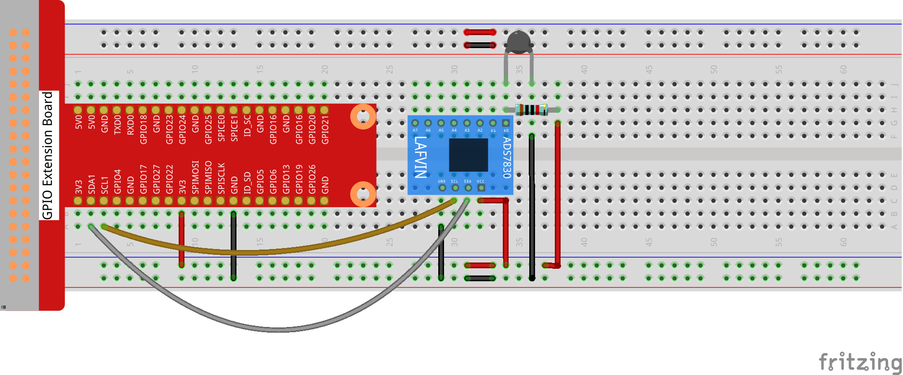

# 2.2.2 Thermistor

## Introduction

Just like photoresistor can sense light, thermistor is a temperature sensitive electronic device that can be used for realizing functions of temperature control, such as making a heat alarm.

## Components


A thermistor is a thermally sensitive resistor that exhibits a precise and predictable change in resistance proportional to small changes in temperature. How much its resistance will change is dependent upon its unique composition. Thermistors are the parts of a larger group of passive components. And unlike their active component counterparts, passive devices are incapable of providing power gain, or amplification to a circuit.

Thermistor is a sensitive element, and it has two types: Negative Temperature Coefficient (NTC) and Positive Temperature Coefficient (PTC), also known as NTC and PTC. Its resistance varies significantly with temperature. The resistance of PTC thermistor increases with temperature ,while the condition of NTC is opposite to the former In this experiment we use NTC.


The principle is that the resistance of the NTC thermistor changes with the temperature of the outer environment. It detects the real-time temperature of the environment. When the temperature gets higher, the resistance of the thermistor decreases. Then the voltage data is converted to digital quantities by the A/D adapter. The temperature in Celsius or Fahrenheit is output via programming.

In this experiment, a thermistor and a 10k pull-up resistor are used. Each thermistor has a normal resistance. Here it is 10k ohm, which is measured under 25 degree Celsius.

Here is the relation between the resistance and temperature:

RT =RN expB(1/TK – 1/TN)

**RT** is the resistance of the NTC thermistor when the temperature is **TK**.

**RN** is the resistance of the NTC thermistor under the rated temperature **TN**. Here, the numerical value of **RN** is 10k.

**TK** is a Kelvin temperature and the unit is K. Here, the numerical value of **TK**is 273.15 + degree Celsius.

**TN** is a rated Kelvin temperature; the unit is K too. Here, the numerical value of **TN** is 273.15+25.

And **B**(beta), the material constant of NTC thermistor, is also called heat sensitivity index with a numerical value 3950.

**exp** is the abbreviation of exponential, and the base number e is a natural number and equals 2.7 approximately.

Convert this formula TK=1/(ln(RT/RN)/B+1/TN) to get Kelvin temperature that minus 273.15 equals degree Celsius.

This relation is an empirical formula. It is accurate only when the temperature and resistance are within the effective range.

## Connect




## Code

### For  C  Language User

Go to the code folder compile and run.

```shell
cd ~/super-starter-kit-for-raspberry-pi/c/2.2.2/
```

```shell
g++ Thermometer.cpp -lwiringPi -lADCDevice
```

```shell
sudo ./a.out
```

With the code run, the thermistor detects ambient temperature which will be printed on the screen once it finishes the program calculation.

This is the complete code

```cpp
#include <wiringPi.h>
#include <stdio.h>
#include <math.h>
#include <ADCDevice.hpp>

ADCDevice *adc;  // Define an ADC Device class object

int main(void){
    adc = new ADCDevice();
    printf("Program is starting ... \n");
    
    else if(adc->detectI2C(0x48)){// Detect the ads7830
        delete adc;               // Free previously pointed memory
        adc = new ADS7830();      // If detected, create an instance of ADS7830.
    }
    else{
        printf("No correct I2C address found, \n"
        "Please use command 'i2cdetect -y 1' to check the I2C address! \n"
        "Program Exit. \n");
        return -1;
    }
    printf("Program is starting ... \n");
    while(1){
        int adcValue = adc->analogRead(0);  //read analog value A0 pin    
        float voltage = (float)adcValue / 255.0 * 3.3;    // calculate voltage    
        float Rt = 10 * voltage / (3.3 - voltage);        //calculate resistance value of thermistor
        float tempK = 1/(1/(273.15 + 25) + log(Rt/10)/3950.0); //calculate temperature (Kelvin)
        float tempC = tempK -273.15;        //calculate temperature (Celsius)
        printf("ADC value : %d  ,\tVoltage : %.2fV, \tTemperature : %.2fC\n",adcValue,voltage,tempC);
        delay(100);
    }
    return 0;
}

```

Python

### For  Python  Language User

Go to the code folder and run.

```sh
cd ~/super-starter-kit-for-raspberry-pi/python
python 2.2.1_Photoresistor.py
```

```python
import RPi.GPIO as GPIO
import time
import math
from ADCDevice import *

adc = ADCDevice() # Define an ADCDevice class object

def setup():
    global adc
    if(adc.detectI2C(0x48)): # Detect the ads7830
        adc = ADS7830()
    else:
        print("No correct I2C address found, \n"
        "Please use command 'i2cdetect -y 1' to check the I2C address! \n"
        "Program Exit. \n");
        exit(-1)
        
def loop():
    while True:
        value = adc.analogRead(0)        # read ADC value A0 pin
        voltage = value / 255.0 * 3.3        # calculate voltage
        Rt = 10 * voltage / (3.3 - voltage)    # calculate resistance value of thermistor
        tempK = 1/(1/(273.15 + 25) + math.log(Rt/10)/3950.0) # calculate temperature (Kelvin)
        tempC = tempK -273.15        # calculate temperature (Celsius)
        print ('ADC Value : %d, Voltage : %.2f, Temperature : %.2f'%(value,voltage,tempC))
        time.sleep(0.01)

def destroy():
    adc.close()
    GPIO.cleanup()
    
if __name__ == '__main__':  # Program entrance
    print ('Program is starting ... ')
    setup()
    try:
        loop()
    except KeyboardInterrupt: # Press ctrl-c to end the program.
        destroy()
```


## Phenomenon

